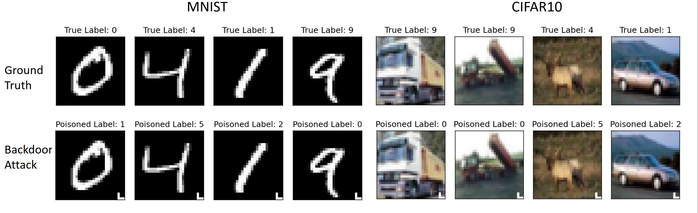

# Bad-Net and Ml-leaks attack
#### This is a simple implementation of the paper "Model and Data Independent Membership Inference Attacks and Defenses on Machine Learning Models" and "BadNets: Identifying Vulnerabilities in the Machine Learning Model Supply Chain" in PyTorch.
## Requirments
Python3 ,PyTorch >= 0.4.0,torchvision >= 0.1.8
## Usage
This code offers two attack options, Backdoor attack and Ml-leaks attack.
For example, to use Backdoor attack on mnist, in `main.py`, use `task(name='Bad_net',dataset='mnist')`.
The default portion of poisoned data is `portion=0.2`. We test the result on `portion=0`,`portion=0.2` and `portion=1`.

To apply Ml-leaks on CIFAR-10, use `task(name='Ml-leaks',dataset='cifar10')` . 
It splits a dataset into `D_shadow` and `D_target`, and trains the `shadow_model`, `target_model` separately, the attack model `D_attack` is trained on `D_shadow` and tested on `D_target` with `train_attack()`.

## Result
To just only accomplish the attack process, the project adopts Le-Net5 as CNN model.
The experimental results still have a lot of room for improvement.

### Attack 1: BadNets
Here are the samples of the clean data and poisoned data with poisoned labels:

|                         |   Clean MNIST   | Poisoned MNIST(20%) | Clean CIFAR-10 | Poisoned CIFAR-10(20%) |
|:-----------------------:|:---------------:|:-------------------:|:--------------:|:----------------------:|
|      Baseline .(%)      |      98.4       |        78.6         |      57.8      |          47.9          |
| All-to-all Backdoor.(%) |      98.9       |        98.7         |      55.3      |          54.0          |

|     Attack Accuracy     | Poisoned MNIST(100%) | Poisoned CIFAR-10(100%) |
|:-----------------------:|:--------------------:|:-----------------------:|
|      Baseline.(%)       |         3.0          |           4.4           |
| All-to-all Backdoor.(%) |         89.1         |          41.9           | 

### Attack 2:  Ml-leaks             
|               | Poisoned MNIST | CIFAR-10 |
|:-------------:|:--------------:|:--------:|
| Accuracy.(%)  |      51.4      |   70.1   |
| Precision.(%) |      50.8      |   61.2   |
|  Recall.(%)   |      51.4      |   70.1   |
